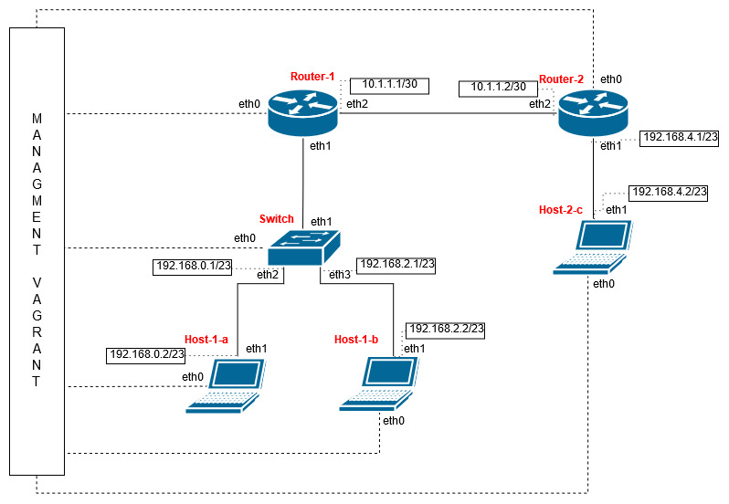

- [DNCS-LAB](#dncs-lab)
- [Requirements](#requirements)
- [How-to](#how-to)
- [Assignment](#assignment)
  - [Design Requirements](#design-requirements)
  - [Tasks](#tasks)
- [Notes and References](#notes-and-references)
- [Design](#design)
  - [Subnet](#subnet)
  - [IP-Map and VLAN](#ip-map-and-vlan)
  - [Realization](#realization)
  - [Command](#command)
  - [Docker](#docker)
# DNCS-LAB

This repository contains the Vagrant files required to run the virtual lab environment used in the DNCS course.
```


        +-----------------------------------------------------+
        |                                                     |
        |                                                     |eth0
        +--+--+                +------------+             +------------+
        |     |                |            |             |            |
        |     |            eth0|            |eth2     eth2|            |
        |     +----------------+  router-1  +-------------+  router-2  |
        |     |                |            |             |            |
        |     |                |            |             |            |
        |  M  |                +------------+             +------------+
        |  A  |                      |eth1                       |eth1
        |  N  |                      |                           |
        |  A  |                      |                           |
        |  G  |                      |                     +-----+----+
        |  E  |                      |eth1                 |          |
        |  M  |            +-------------------+           |          |
        |  E  |        eth0|                   |           |  host-c  |
        |  N  +------------+      SWITCH       |           |          |
        |  T  |            |                   |           |          |
        |     |            +-------------------+           +----------+
        |  V  |               |eth2         |eth3                |eth0
        |  A  |               |             |                    |
        |  G  |               |             |                    |
        |  R  |               |eth1         |eth1                |
        |  A  |        +----------+     +----------+             |
        |  N  |        |          |     |          |             |
        |  T  |    eth0|          |     |          |             |
        |     +--------+  host-a  |     |  host-b  |             |
        |     |        |          |     |          |             |
        |     |        |          |     |          |             |
        ++-+--+        +----------+     +----------+             |
        | |                              |eth0                   |
        | |                              |                       |
        | +------------------------------+                       |
        |                                                        |
        |                                                        |
        +--------------------------------------------------------+


```

# Requirements
 - Python 3
 - 10GB disk storage
 - 2GB free RAM
 - Virtualbox
 - Vagrant (https://www.vagrantup.com)
 - Internet

# How-to
 - Install Virtualbox and Vagrant
 - Clone this repository
`git clone https://github.com/dustnic/dncs-lab`
 - You should be able to launch the lab from within the cloned repo folder.
```
cd dncs-lab
[~/dncs-lab] vagrant up
```
Once you launch the vagrant script, it may take a while for the entire topology to become available.
 - Verify the status of the 4 VMs
```
[dncs-lab]$ vagrant status
Current machine states:

router                    running (virtualbox)
switch                    running (virtualbox)
host-a                    running (virtualbox)
host-b                    running (virtualbox)
```
- Once all the VMs are running verify you can log into all of them:
`vagrant ssh router`
`vagrant ssh switch`
`vagrant ssh host-a`
`vagrant ssh host-b`
`vagrant ssh host-c`

# Assignment
This section describes the assignment, its requirements and the tasks the student has to complete.
The assignment consists in a simple piece of design work that students have to carry out to satisfy the requirements described below.
The assignment deliverable consists of a Github repository containing:
- the code necessary for the infrastructure to be replicated and instantiated
- an updated README.md file where design decisions and experimental results are illustrated
- an updated answers.yml file containing the details of 

## Design Requirements
- Hosts 1-a and 1-b are in two subnets (*Hosts-A* and *Hosts-B*) that must be able to scale up to respectively 260 and 341 usable addresses
- Host 2-c is in a subnet (*Hub*) that needs to accommodate up to 493 usable addresses
- Host 2-c must run a docker image (dustnic82/nginx-test) which implements a web-server that must be reachable from Host-1-a and Host-1-b
- No dynamic routing can be used
- Routes must be as generic as possible
- The lab setup must be portable and executed just by launching the `vagrant up` command

## Tasks
- Fork the Github repository: https://github.com/dustnic/dncs-lab
- Clone the repository
- Run the initiator script (dncs-init). The script generates a custom `answers.yml` file and updates the Readme.md file with specific details automatically generated by the script itself.
  This can be done just once in case the work is being carried out by a group of (<=2) engineers, using the name of the 'squad lead'. 
- Implement the design by integrating the necessary commands into the VM startup scripts (create more if necessary)
- Modify the Vagrantfile (if necessary)
- Document the design by expanding this readme file
- Fill the `answers.yml` file where required (make sure that is committed and pushed to your repository)
- Commit the changes and push to your own repository
- Notify the examiner that work is complete specifying the Github repository, First Name, Last Name and Matriculation number. This needs to happen at least 7 days prior an exam registration date.

# Notes and References
- https://rogerdudler.github.io/git-guide/
- http://therandomsecurityguy.com/openvswitch-cheat-sheet/
- https://www.cyberciti.biz/faq/howto-linux-configuring-default-route-with-ipcommand/
- https://www.vagrantup.com/intro/getting-started/


# Design

The dcns-script assigned me 3 values that need to be the number of scalable hosts in the subnets. These 3 numbers are:
- 260 for host-A
- 341 for host-B
- 493 for host-C 

#### Subnet

I decided to create 4 subnets:

1.  The first is between _router-1_ and _router-2_, for this subnet I used subnet 10.1.1.0/30 to cover only the 2 routers (2<sup>32-30</sup>-2=2).
2. The second is between _router-1_ and _host-a_, in this case I used the subnet 192.168.0.0/23 to cover the 260 requested address (2<sup>32-23</sup>-2=510).
3. The third is between _router-1_ and _host-b_, the subnet used is 192.168.2.0/23 that covers the 341 address (2<sup>32-23</sup>-2=510).
4. The last is between _router-2_ and _host-c_, here I used the subnet 192.168.4.0/23 to cover all the 493 address (2<sup>32-23</sup>-2=510).

#### IP-Map and VLAN
|  Device  | Interface |     IP      | Subnet |
| :------: | :-------: | :---------: | :----: |
| Router-1 |  enp0s9   |  10.1.1.1   |   1    |
| Router-2 |  enp0s9   |  10.1.1.2   |   1    |
| Router-1 | enp0s8.2  | 192.168.0.1 |   2    |
|  Host-a  |  enp0s8   | 192.168.0.2 |   2    |
| Router-1 | enp0s8.3  | 192.168.2.1 |   3    |
|  Host-b  |  enp0s8   | 192.168.2.2 |   3    |
| Router-2 |  enp0s8   | 192.168.4.1 |   4    |
|  Host-c  |  enp0s8   | 192.168.4.2 |   4    |

I created 2 VLAN for the subnets 2 and 3. The first is for the subnet one and has the Tag that equals 2, the second VLAN is for the subnet 3 and the Tag is 3.



#### Realization

All the commands I used are included in the shell scripts that will run at the creation of the Virtual Machines with the `vagrant up` command. I created one script for each device. I decided to map the IP in this mode to make the routes as generic as possible and so create only 1 route versus the 3 hosts. I used 192.168.0.0/21 as the destination of the route to cover all the IP from 192.168.0.0 to 192.168.5.255.

##### Command

- To enable the IP forwarding in the routers I used the `sysctl -w net.ipv4.ip_forward=1` command.
- To add an IP address to a port the command used is `ip add add 10.1.1.1/30 dev enp0s9`.
- To set a port to up I used the `ip link set dev enp0s9 up` command.
- The command used to create a VLAN is `ip link add link enp0s8 name enp0s8.2 type vlan id 2`.
- To create a route I used the `ip route add 192.168.0.0/21 via 192.168.0.1` command.
- To set up the switch and assign a VLAN tag to the ports I used the following commands:
```shell
ovs-vsctl add-br switch
ovs-vsctl add-port switch enp0s8
ovs-vsctl add-port switch enp0s9 tag="2"
ovs-vsctl add-port switch enp0s10 tag="3"
```
- Finally to install docker and run it on the host-c I used:
```shell
apt-get update
apt -y install docker.io
systemctl start docker
systemctl enable docker
docker pull dustnic82/nginx-test
docker run -d -p 80:80 dustnic82/nginx-test
```
##### Docker
The web-server on the host-c is reachable from host-a and host-b. If the server is running and we execute from one the hosts the command
```shell 
vagrant@host-a:~$ curl 192.168.4.2 
```
The output must be:
```html
<!DOCTYPE html>
<html>
<head>
<title>Welcome to nginx!</title>
<style>
    body {
        width: 35em;
        margin: 0 auto;
        font-family: Tahoma, Verdana, Arial, sans-serif;
    }
</style>
</head>
<body>
<h1>Welcome to nginx!</h1>
<p>If you see this page, the nginx web server is successfully installed and
working. Further configuration is required.</p>

<p>For online documentation and support please refer to
<a href="http://nginx.org/">nginx.org</a>.<br/>
Commercial support is available at
<a href="http://nginx.com/">nginx.com</a>.</p>

<p><em>Thank you for using nginx.</em></p>
</body>
</html>
```
